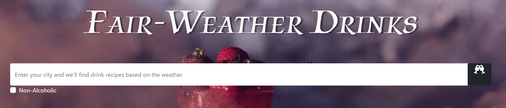
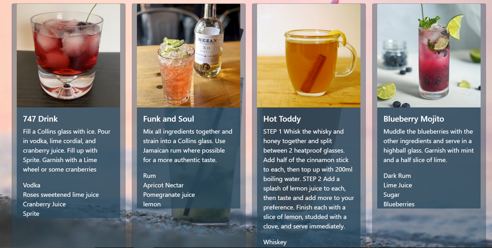

# Fair-Weather Drinks

## Description

Input your current location to see a list of drinks that will pair well with your current weather. We wanted to give an ideal drink recipe for our users. Together we decided to build this as an easy way for ideas and recipes to be combined about what to drink. We have learned how to pull information from more than one API to use the data in an integrated way.

## Installation

Our application will be deployed through github.com.
follow this link https://wolfe-nate.github.io/Fair-WeatherDrinks/

## Usage

Input current location into the white bar onscreen, then press ENTER, or click the button on the right for your drink list to show up.

Choose between the choices provided on the newly shown cards. Click on the cards shown to follow the link to recipe.

## Credits

Alex Hageman https://github.com/ahageman27

Chris Smith https://github.com/63csmith

Luke Renoe https://github.com/lukerenoe

Nate Wolfe https://github.com/Wolfe-Nate

## License

MIT License

Copyright (c) [2022] [Nathaniel Wolfe]

Permission is hereby granted, free of charge, to any person obtaining a copy
of this software and associated documentation files (the "Software"), to deal
in the Software without restriction, including without limitation the rights
to use, copy, modify, merge, publish, distribute, sublicense, and/or sell
copies of the Software, and to permit persons to whom the Software is
furnished to do so, subject to the following conditions:

The above copyright notice and this permission notice shall be included in all
copies or substantial portions of the Software.

THE SOFTWARE IS PROVIDED "AS IS", WITHOUT WARRANTY OF ANY KIND, EXPRESS OR
IMPLIED, INCLUDING BUT NOT LIMITED TO THE WARRANTIES OF MERCHANTABILITY,
FITNESS FOR A PARTICULAR PURPOSE AND NONINFRINGEMENT. IN NO EVENT SHALL THE
AUTHORS OR COPYRIGHT HOLDERS BE LIABLE FOR ANY CLAIM, DAMAGES OR OTHER
LIABILITY, WHETHER IN AN ACTION OF CONTRACT, TORT OR OTHERWISE, ARISING FROM,
OUT OF OR IN CONNECTION WITH THE SOFTWARE OR THE USE OR OTHER DEALINGS IN THE
SOFTWARE.
